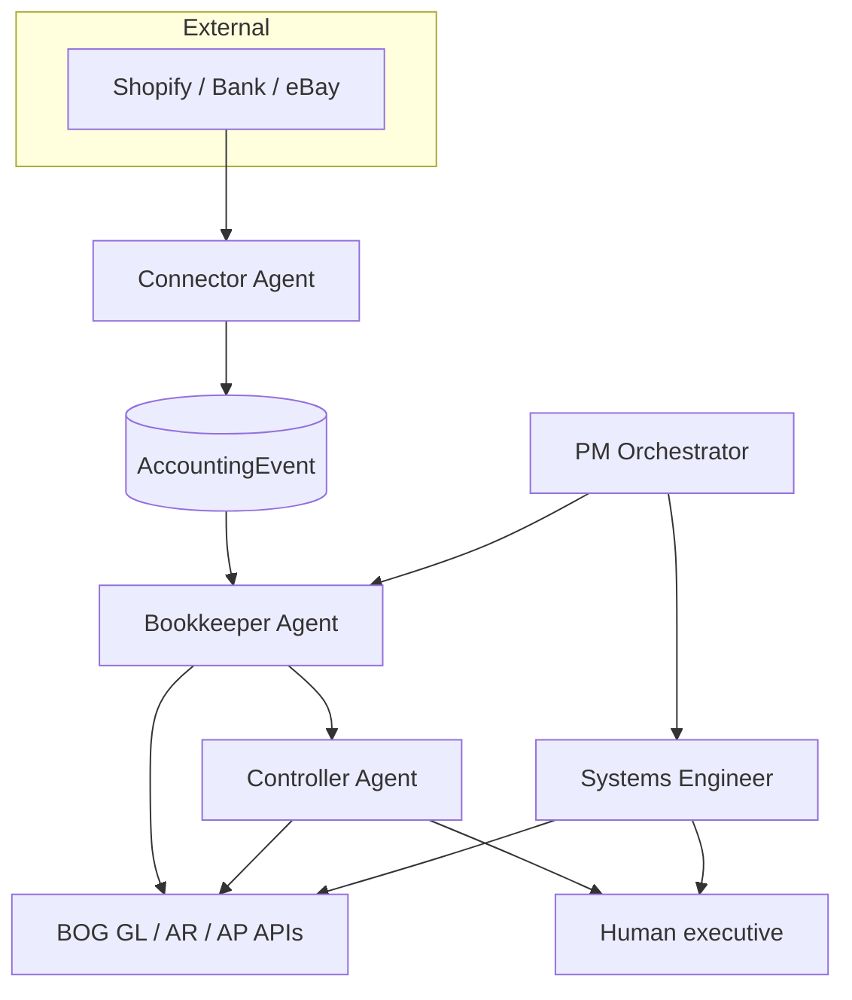

# Agent organization — automated accounting program

BOG is an **accounting program**, not only an app. This doc defines the **agent org** that runs it: who does what, how work flows, and what is wired in code today.

**Human executive:** You approve material changes, merges, and production deploys. Agents draft and route; they do not silently change live books or ship breaking schema without you.

---

## Minimum viable team (ship first)

| # | Agent | Role |
|---|--------|------|
| 1 | **PM Orchestrator** | Priorities, digest, work queue, schedules |
| 2 | **Systems Engineer** | Implements code from build tickets — reuses BOG kernel |
| 3 | **Bookkeeper (RTR)** | Event → classify → draft queue → (future) post |
| 4 | **Connector** | Shopify / bank / eBay → normalized `AccountingEvent` |
| 5 | **Controller** | Review exceptions, approve/reject before post & close |
| 6 | **You** | Merge, deploy, policy, legal |

Phase 2 specialists: AP, AR, Collections, CFO narrative, Tax prep — they **feed requirements** into PM + Systems Engineer.

---

## Org chart (handoffs)



---

## Agent charters (summary)

### PM Orchestrator
- **In:** stuck events, open work counts, product feedback, intel digest themes.
- **Out:** prioritized `AgentWorkItem` rows, daily digest, cron triggers for bookkeeper.
- **Must not:** post journals or change GL accounts.

### Systems Engineer
- **In:** `buildSpecJson` tickets from PM (schema, route, UI, connector).
- **Out:** PR-ready code using existing patterns (`CreationDedupKey`, `invoiceGlPost`, permissions).
- **Must not:** auto-merge to production; skip Controller for accounting behavior changes.

### Bookkeeper (record-to-ledger)
- **In:** `AccountingEvent` rows (`RECEIVED`).
- **Out:** classified status, Controller review items, (later) AR invoice + JE drafts.
- **Must not:** bypass period close or post without approval rules.

### Connector
- **In:** webhooks / scheduled pull from allow-listed integrations.
- **Out:** `POST /api/agent-org/events` with `source` + `externalId` + `payload`.
- **Must not:** open-web crawl; store secrets in repo.

### Controller
- **In:** `NEEDS_REVIEW` events and open review work items.
- **Out:** `PATCH` approve/reject; close discipline via existing period-close APIs.
- **Must not:** redefine company policy without executive sign-off.

---

## Code spine (implemented)

| Piece | Location |
|-------|----------|
| Models | `AccountingEvent`, `AgentWorkItem` in `prisma/schema.prisma` |
| Ingest | `server/services/agentOrg/ingestEvent.ts` |
| Bookkeeper job | `server/services/agentOrg/bookkeeperJob.ts` |
| PM digest | `server/services/agentOrg/pmDigest.ts` |
| API | `server/routes/agentOrg.ts` → `/api/agent-org/*` |
| Cursor skills | `.cursor/skills/bog-*` |

### API (requires `DATABASE_URL`)

| Method | Path | Auth |
|--------|------|------|
| POST | `/api/agent-org/events` | JWT (any active user — connector uses service account later) |
| GET | `/api/agent-org/events` | President / CFO / Controller |
| PATCH | `/api/agent-org/events/:id` | Executive — Controller triage |
| POST | `/api/agent-org/run-bookkeeper` | Executive |
| POST | `/api/agent-org/run-bookkeeper-cron` | Header `x-agent-org-secret` |
| GET | `/api/agent-org/work` | Executive |
| POST | `/api/agent-org/work` | Executive — PM build tickets |
| PATCH | `/api/agent-org/work/:id` | Executive |
| GET | `/api/agent-org/digest` | Executive — PM daily snapshot |

### Cron example

```bash
curl -fsS -X POST "$API_URL/api/agent-org/run-bookkeeper-cron" \
  -H "x-agent-org-secret: $AGENT_ORG_CRON_SECRET"
```

---

## Cursor skills (invoke by name)

| Skill | When to use |
|-------|-------------|
| `bog-pm-orchestrator` | Prioritize backlog, digest, open work tickets |
| `bog-systems-engineer` | Implement a build spec in the repo |
| `bog-bookkeeper` | Process events, classification, posting rules |
| `bog-connector` | Shopify/integration ingest design |
| `bog-controller` | Review queue, approve/reject, close checks |

---

## Next build tickets (suggested)

1. **Connector:** Shopify `orders/paid` webhook → `AccountingEvent` (`SALE_ORDER_PAID`).
2. **Bookkeeper:** Auto-draft AR invoice from sale payload (still Controller-approved before post).
3. **Systems Engineer:** GL mapping settings (revenue, tax, fees accounts) per company.
4. **PM Automation:** weekday cron → bookkeeper + digest to you.

**Shopify:** see **`SHOPIFY_CONNECTOR.md`** — webhook path `/api/connectors/shopify/webhook`.

---

## Related docs

- `PROGRAM_DIRECTION.md` — product strategy
- `CREATION_SAFETY.md` — idempotency pattern for connectors
- `PRODUCT_INTELLIGENCE.md` — feedback rail (feeds PM backlog)
